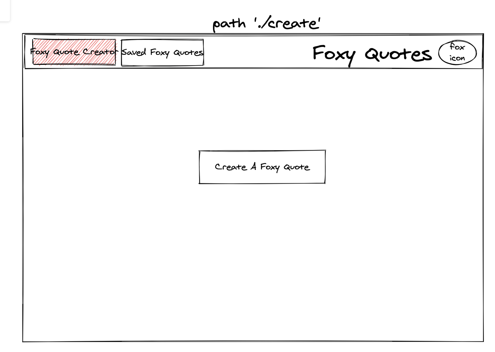
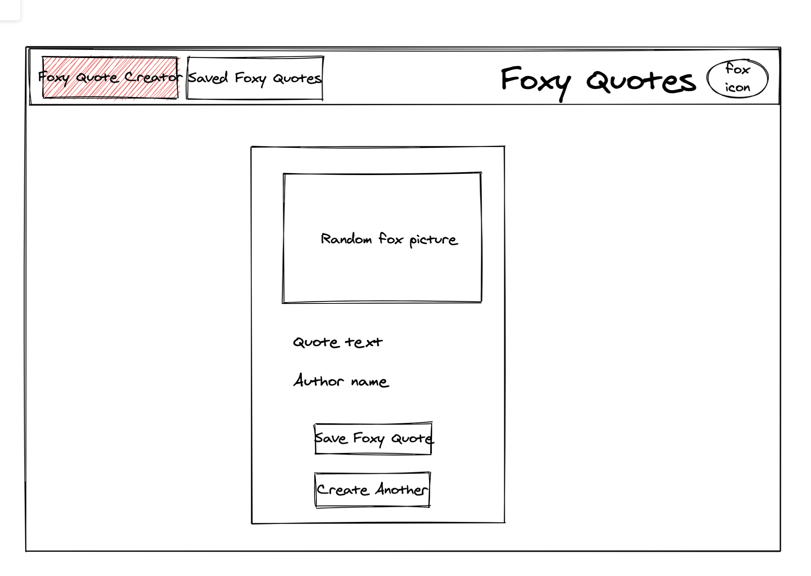
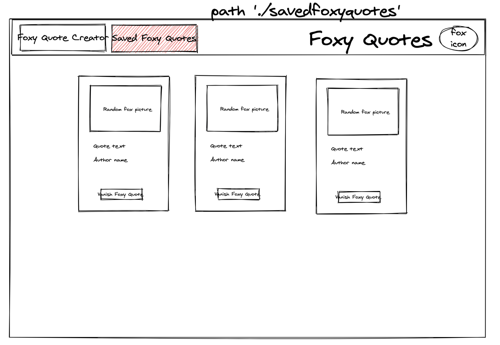
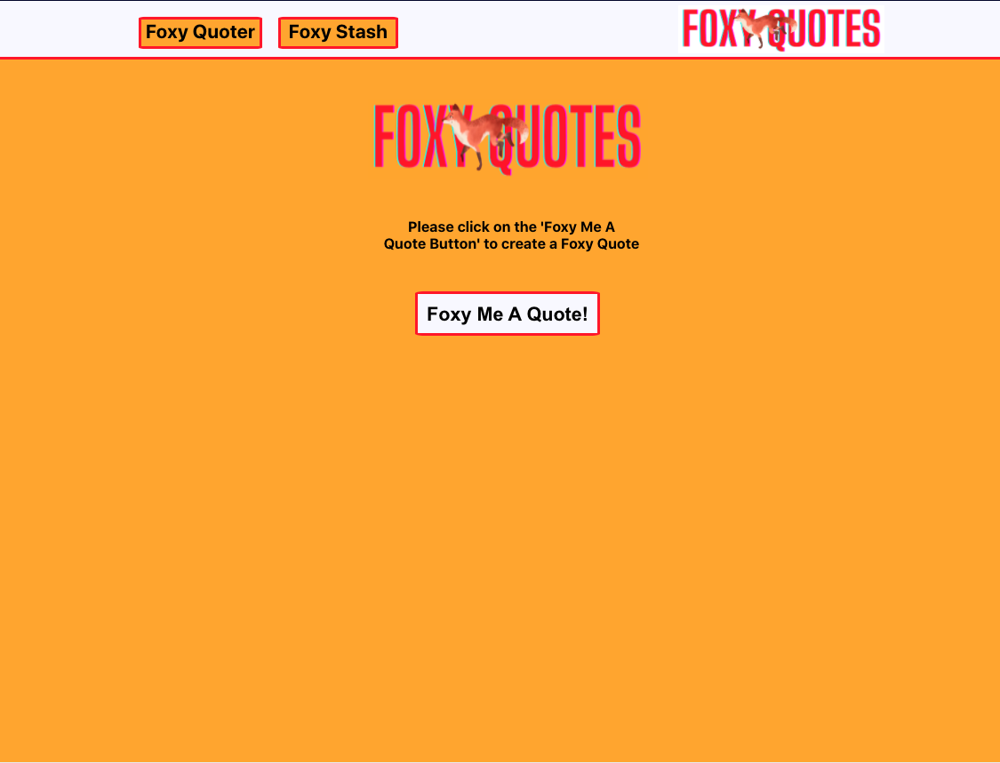
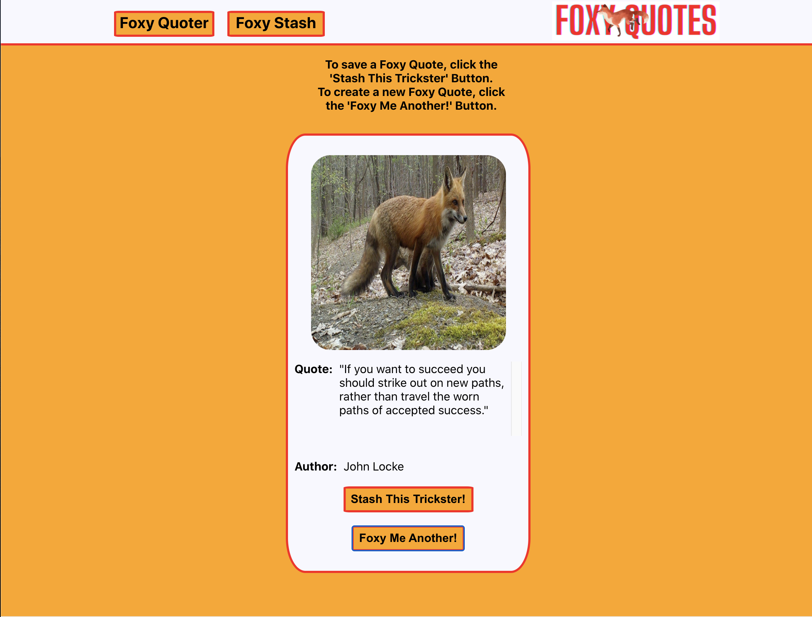
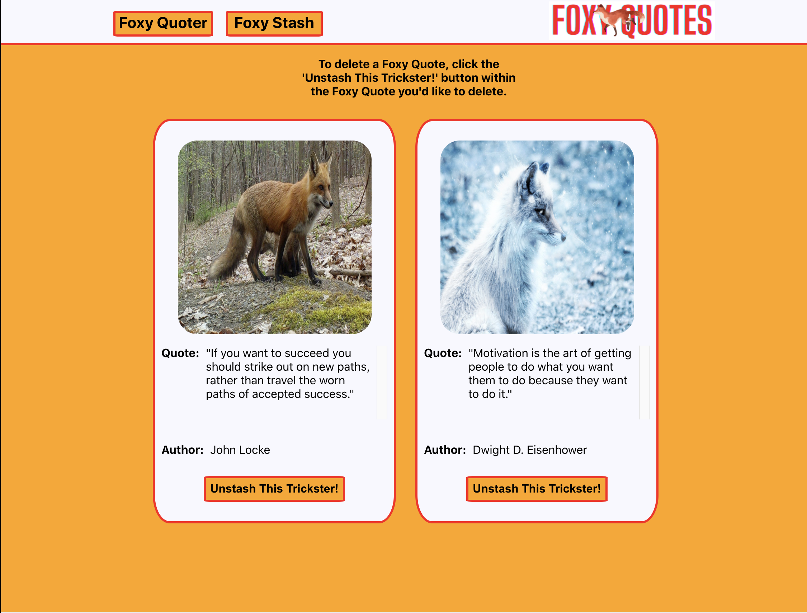
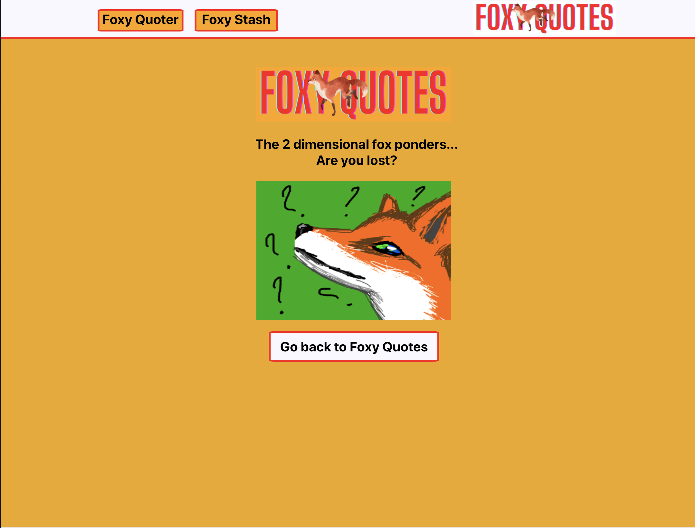

# [Foxy Quotes](https://foxy-quotes.herokuapp.com/foxy-quoter) *Solo Project*

By: [Chadrick Dickerson](https://github.com/chadrick-d-dev)

## Table of Contents

* [Project Overview](#project-overview)
* [Chosen API Servers](#chosen-api-servers)
* [Goals](#goals)
* [Technologies And Tools](#technologies-and-tools)
* [Wireframe](#wireframe)
* [Foxy Quotes In Action](#foxy-quotes-in-action)
* [Challenges](#challenges)
* [Wins](#wins)
* [Roadmap](#roadmap)
* [Contributors](#contributors)

## Project Overview

For my Turing Module 3 Frontend solo final project I was tasked with coming up with a "very" specific target audience to create an app for. I came up with a target audience of intellectual fox enthusiasts. I chose to create an app that allowed them to create randomly generated fox pictures with inpirational quotes obtained from a list of available API servers. I call this combination of fox pictures and inspirational quotes "Foxy Quotes." Users are able to create Foxy Quotes, save them, and delete them!

## Chosen API Servers
* [RandomFox](https://randomfox.ca/floof/) *Random Fox Pictures*
* [Quotable](https://api.quotable.io/random?tags=inspirational) *Random Ispirational Quotes*

## Goals
* Build a React App using Router, and asynchronous javascript 
* Make successful API calls to chosen servers
* Build out a cleanly designed, intuitive, and accessible frontend
* Thouroughly Test My files

## Technologies And Tools
> * React (With hooks)
> * React Testing (with Jest)
> * Router
> * JavaScript
> * JSX
> * Heroku Deployment
> * git
> * GitHub
> * Terminal

## Wireframe

## Foxy Quotes in Action:

  
Set up & Contributions

* *Click* the **Fork** button on the top right-hand corner of this page
* Clone the repository down and cd into the repo on your local machine by running:
  * git clone https://github.com/"your-git-hub-here"/foxy-quotes
  * cd into `foxy-quotes` locally
* Install the library dependencies by running:
  * `npm install`
* To verify that it is setup correctly, run `npm start` in your terminal.
* Go to `http://localhost:3000/` and you should see the site.
* Enter `control + c` in your terminal to stop the server at any time.
* Add your changes, push up to GitHub and submit a pull request

## Challenges
* Implementation of React Hooks in the beginning
* Hosting my server on heroku

## Wins
* Building this app within a 5 day window!
* Creating and passing 40 tests including unit, integration, and async testing!
* Passing and manipulating data to suit the needs of user interaction

## Roadmap
With more time, I would like to enhance the UI/UX by:
* User authentication
* Add Favicon
* Further styling
* Background switching functionality that changes background whenever the user has saved increments of three Foxy Quotes
* Implementation of Local Storage for data persistence
* Share Quotes on Social Media
* Email Quotes
* Option to rewind created/unsaved quotes

## Project Managers

#### Leta Keane
#### Will Mitchell

## Contributors

- [Chadrick Dickerson](https://github.com/chadrick-d-dev)

## To where thanks is Due,

* [Lola Dolinsky](https://github.com/lo-la-do-li)
* [Eric Fitzsimons](https://github.com/ericfitzsimons451)
* [Leta Keane](https://github.com/letakeane)
* [Will Mitchell](https://github.com/wvmitchell)
